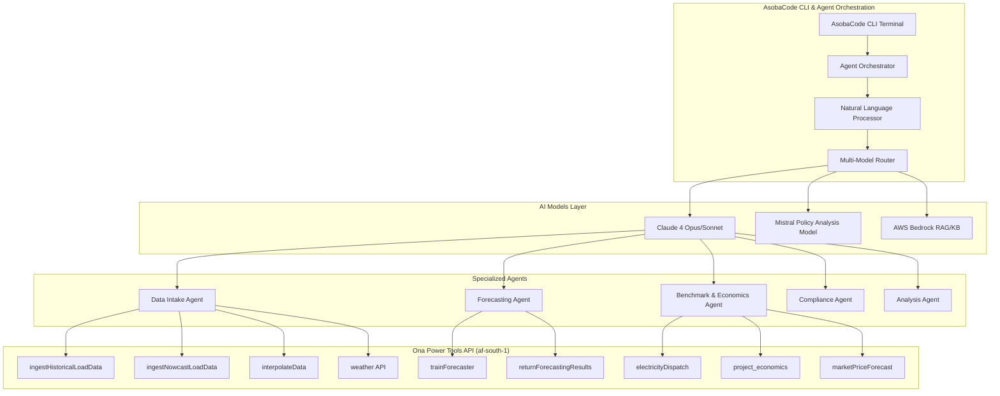

# Agentic Use

**Leverage Ona's Power Tools through AI Agent Orchestration**

## Overview

The Ona platform can be intelligently accessed through **AsobaCode CLI** and **AI agent workflows**, enabling sophisticated analysis and automation for energy systems. This approach allows you to combine Ona's forecasting and analysis capabilities with advanced AI reasoning for complex, multi-step energy assessments.

## Architecture Overview



## Getting Started with Agentic Workflows

### 1. Installation & Setup

```bash
# Clone the AsobaCode repository
git clone https://github.com/AsobaCloud/asoba-code.git
cd asoba-code

# Install dependencies
pip install -e .

# Configure for Ona API region
export AWS_DEFAULT_REGION=af-south-1
export ONA_API_KEY=your_api_key_here

# Launch interactive mode
asoba-code --interactive
```

### 2. Basic Agent-Powered Analysis

The simplest way to leverage agentic capabilities is through natural language commands:

```bash
asoba-code --interactive
```

**Example prompts:**

```
> "Analyze the uploaded solar generation data, train a forecasting model, and provide P50/P90 performance curves with confidence intervals"

> "Process historical load data, perform weather normalization, and generate a comprehensive risk assessment report"

> "Ingest the CSV data, clean it using interpolation, train a forecaster, and compare results against industry benchmarks"
```

## Core Agent Workflows

### Data Processing Agent

**Purpose**: Automated data ingestion, cleaning, and validation

**Ona API Integration**:
- `ingestHistoricalLoadData` - Process historical datasets
- `ingestNowcastLoadData` - Handle real-time data streams
- `interpolateData` - Clean and standardize time series
- `weather` - Contextual weather data integration

**Example Workflow**:
```python
# Through natural language instruction to agent:
"Upload this 24-month solar generation CSV, clean any gaps using interpolation, 
and provide a data quality assessment report"
```

**Agent Actions**:
1. Calls `ingestHistoricalLoadData` with uploaded CSV
2. Analyzes data quality and identifies gaps
3. Uses `interpolateData` to standardize intervals
4. Applies `weather` API for normalization context
5. Generates comprehensive data readiness report

### Forecasting Agent

**Purpose**: Intelligent model training and prediction generation

**Ona API Integration**:
- `trainForecaster` - Deploy machine learning models
- `returnForecastingResults` - Generate prediction curves
- Advanced confidence interval analysis

**Example Workflow**:
```python
# Agent instruction:
"Train a forecasting model on this plant data and generate P50/P90 curves 
with seasonal variability analysis"
```

**Agent Actions**:
1. Analyzes historical patterns and seasonality
2. Calls `trainForecaster` with optimized parameters
3. Retrieves results via `returnForecastingResults`
4. Performs statistical analysis of confidence bands
5. Generates visualizations and performance metrics

### Economics & Benchmark Agent

**Purpose**: Revenue optimization and market analysis

**Ona API Integration**:
- `electricityDispatch` - Optimal dispatch strategies
- `project_economics` - NPV, IRR, LCOE calculations
- `marketPriceForecast` - Price sensitivity analysis

**Example Workflow**:
```python
# Agent instruction:
"Analyze this solar project's economic performance, optimize dispatch strategy, 
and provide market risk assessment"
```

**Agent Actions**:
1. Processes project financial parameters
2. Calls `electricityDispatch` for revenue optimization
3. Uses `project_economics` for comprehensive financial modeling
4. Integrates `marketPriceForecast` for risk analysis
5. Delivers actionable economic insights

## Advanced Use Cases

### 1. Multi-Step Risk Assessment

```bash
> "Perform comprehensive insurance risk assessment on this solar dataroom. 
Include underwriting analysis, premium calculation, and policy recommendations."
```

**Agent Workflow**:
1. **Document Review**: Parse technical specifications and maintenance records
2. **Data Processing**: Ingest historical performance data
3. **Forecasting**: Generate performance predictions with confidence intervals
4. **Economic Analysis**: Model revenue scenarios and risk factors
5. **Risk Scoring**: Calculate integrated risk metrics
6. **Report Generation**: Compile comprehensive assessment with audit trail

### 2. Performance Benchmarking

```bash
> "Compare this wind farm's performance against industry benchmarks and 
identify optimization opportunities"
```

**Agent Workflow**:
1. **Data Ingestion**: Process plant operational data
2. **Normalization**: Apply weather corrections
3. **Benchmarking**: Compare against industry standards
4. **Gap Analysis**: Identify performance deviations
5. **Optimization**: Recommend operational improvements

### 3. Real-Time Monitoring Setup

```bash
> "Set up continuous monitoring for this portfolio with automated alerts 
for performance deviations"
```

**Agent Workflow**:
1. **Stream Configuration**: Set up nowcast data ingestion
2. **Baseline Establishment**: Create performance thresholds
3. **Alert Rules**: Configure deviation triggers
4. **Dashboard Setup**: Real-time visualization
5. **Reporting**: Automated anomaly reports

## Agent Communication Patterns

### Sequential Workflows
Agents can chain API calls for complex analysis:

```python
DataAgent → ForecastAgent → EconomicsAgent → ReportAgent
```

### Parallel Processing
Multiple agents can work simultaneously:

```python
DataAgent ∥ WeatherAgent ∥ MarketAgent → AnalysisAgent
```

### Feedback Loops
Agents can iterate and refine based on results:

```python
ForecastAgent → ValidationAgent → (if unsatisfactory) → ForecastAgent
```

## Best Practices

### 1. Prompt Engineering

**Effective prompts include**:
- Clear objectives and expected outputs
- Specific data requirements and constraints
- Quality thresholds and validation criteria
- Reporting format preferences

**Example**:
```
"Analyze the uploaded 18-month solar irradiance and generation data. 
Ensure data quality >95%, train a forecasting model with P50 MAE <5%, 
and generate a technical report with confidence intervals and seasonal analysis."
```

### 2. Data Preparation

**Best practices**:
- Ensure data completeness and consistent timestamps
- Include relevant metadata (location, capacity, equipment specs)
- Validate data quality before analysis
- Provide context about operational conditions

### 3. Workflow Optimization

**Strategies**:
- Break complex tasks into logical steps
- Use parallel agent execution where possible
- Implement validation checkpoints
- Maintain audit trails for reproducibility

## Integration Examples

### Python Integration

```python
import asoba_code

# Initialize agent orchestrator
orchestrator = asoba_code.AgentOrchestrator(
    api_key="your_ona_api_key",
    region="af-south-1"
)

# Execute agentic workflow
result = orchestrator.execute(
    prompt="Analyze solar performance and generate forecasts",
    data_sources=["solar_generation.csv", "irradiance_data.csv"],
    output_format="comprehensive_report"
)
```

### CLI Scripting

```bash
#!/bin/bash
# Automated analysis pipeline

asoba-code analyze \
  --data "historical_data.csv" \
  --workflow "forecasting" \
  --output "forecast_report.json" \
  --agents "data,forecast,economics"
```

## Monitoring & Debugging

### Agent Execution Tracking

All agent workflows provide detailed execution logs:

```json
{
  "workflow_id": "wf_12345",
  "agents_used": ["DataAgent", "ForecastAgent"],
  "api_calls": [
    {
      "endpoint": "ingestHistoricalLoadData",
      "timestamp": "2024-01-15T10:30:00Z",
      "status": "success",
      "s3_key": "processed/data_12345.parquet"
    }
  ],
  "execution_time": "45.2s",
  "quality_metrics": {
    "data_completeness": 0.98,
    "forecast_accuracy": 0.95
  }
}
```

### Error Handling

Agents automatically handle common issues:
- Data quality problems
- API rate limits
- Model training failures
- Network connectivity issues

## Advanced Configuration

### Custom Agent Development

Create specialized agents for specific use cases:

```python
class CustomRiskAgent(BaseAgent):
    """Specialized agent for insurance risk assessment"""
    
    def __init__(self):
        super().__init__()
        self.ona_apis = ["ingestHistoricalLoadData", "trainForecaster", "weather"]
    
    async def assess_risk(self, dataroom_path: str) -> RiskAssessment:
        # Custom risk assessment logic
        pass
```

### Multi-Region Deployment

Configure agents for different geographic regions:

```yaml
# agent_config.yaml
regions:
  af-south-1:
    endpoints: ["ingest", "forecast", "weather"]
    priority: primary
  us-east-1:
    endpoints: ["rag", "policy_analysis"]
    priority: secondary
```

## Support & Resources

### Documentation
- [Agent Development Guide](./agent-development.html)
- [API Integration Patterns](./integration-patterns.html)
- [Best Practices Handbook](./best-practices.html)

### Community
- [GitHub Repository](https://github.com/AsobaCloud/asoba-code)
- [Discord Community](https://discord.gg/asoba)
- [Technical Support](mailto:support@asoba.co)

### Training Resources
- Agent orchestration workshops
- Custom workflow development
- Integration consulting services

---

**Ready to get started?** Begin with our [Quickstart Guide](./index.html#choose-your-path) or dive into [API Reference](./endpoints.html) for detailed endpoint documentation.