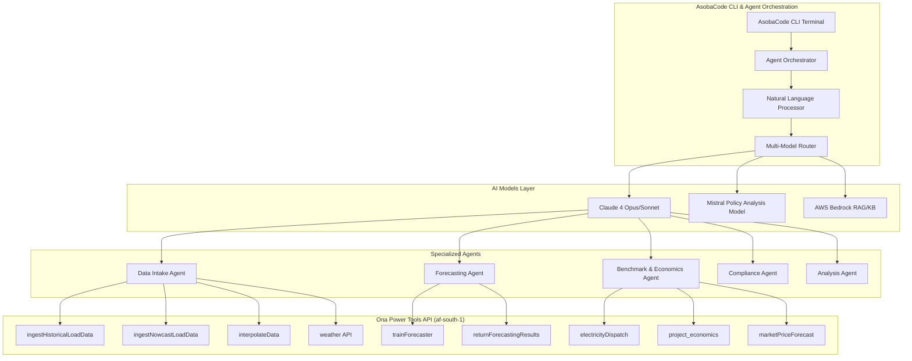

# Agentic Use

**Leverage Ona's Power Tools through AI Agent Orchestration**

## Overview

The Ona platform can be intelligently accessed through **AsobaCode CLI** and **AI agent workflows**, enabling sophisticated analysis and automation for energy systems. This approach allows you to combine Ona's forecasting and analysis capabilities with advanced AI reasoning for complex, multi-step energy assessments.

## Architecture Overview



## Getting Started with Agentic Workflows

### 1. Installation & Setup

```bash
# Clone the AsobaCode repository
git clone https://github.com/AsobaCloud/asoba-code.git
cd asoba-code

# Install dependencies
pip install -e .

# Configure for Ona API region
export AWS_DEFAULT_REGION=af-south-1
export ONA_API_KEY=your_api_key_here

# Launch interactive mode
asoba-code --interactive
```

### 2. Basic Agent-Powered Analysis

The simplest way to leverage agentic capabilities is through natural language commands:

```bash
asoba-code --interactive
```

**Example prompts:**

```
> "Analyze the uploaded solar generation data, train a forecasting model, and provide P50/P90 performance curves with confidence intervals"

> "Process historical load data, perform weather normalization, and generate a comprehensive risk assessment report"

> "Ingest the CSV data, clean it using interpolation, train a forecaster, and compare results against industry benchmarks"
```

## Core Agent Workflows

### Data Processing Agent

**Purpose**: Automated data ingestion, cleaning, and validation

**Ona API Integration**:
- `ingestHistoricalLoadData` - Process historical datasets
- `ingestNowcastLoadData` - Handle real-time data streams
- `interpolateData` - Clean and standardize time series
- `weather` - Contextual weather data integration

**Example Workflow**:
```python
# Through natural language instruction to agent:
"Upload this 24-month solar generation CSV, clean any gaps using interpolation, 
and provide a data quality assessment report"
```

**Agent Actions**:
1. Calls `ingestHistoricalLoadData` with uploaded CSV
2. Analyzes data quality and identifies gaps
3. Uses `interpolateData` to standardize intervals
4. Applies `weather` API for normalization context
5. Generates comprehensive data readiness report

### Forecasting Agent

**Purpose**: Intelligent model training and prediction generation

**Ona API Integration**:
- `trainForecaster` - Deploy machine learning models
- `returnForecastingResults` - Generate prediction curves
- Advanced confidence interval analysis

**Example Workflow**:
```python
# Agent instruction:
"Train a forecasting model on this plant data and generate P50/P90 curves 
with seasonal variability analysis"
```

**Agent Actions**:
1. Analyzes historical patterns and seasonality
2. Calls `trainForecaster` with optimized parameters
3. Retrieves results via `returnForecastingResults`
4. Performs statistical analysis of confidence bands
5. Generates visualizations and performance metrics

### Economics & Benchmark Agent

**Purpose**: Revenue optimization and market analysis

**Ona API Integration**:
- `electricityDispatch` - Optimal dispatch strategies
- `project_economics` - NPV, IRR, LCOE calculations
- `marketPriceForecast` - Price sensitivity analysis

**Example Workflow**:
```python
# Agent instruction:
"Analyze this solar project's economic performance, optimize dispatch strategy, 
and provide market risk assessment"
```

**Agent Actions**:
1. Processes project financial parameters
2. Calls `electricityDispatch` for revenue optimization
3. Uses `project_economics` for comprehensive financial modeling
4. Integrates `marketPriceForecast` for risk analysis
5. Delivers actionable economic insights

## Advanced Use Cases

### 1. Multi-Step Risk Assessment

```bash
> "Perform comprehensive insurance risk assessment on this solar dataroom. 
Include underwriting analysis, premium calculation, and policy recommendations."
```

**Agent Workflow**:
1. **Document Review**: Parse technical specifications and maintenance records
2. **Data Processing**: Ingest historical performance data
3. **Forecasting**: Generate performance predictions with confidence intervals
4. **Economic Analysis**: Model revenue scenarios and risk factors
5. **Risk Scoring**: Calculate integrated risk metrics
6. **Report Generation**: Compile comprehensive assessment with audit trail

### 2. Performance Benchmarking

```bash
> "Compare this wind farm's performance against industry benchmarks and 
identify optimization opportunities"
```

**Agent Workflow**:
1. **Data Ingestion**: Process plant operational data
2. **Normalization**: Apply weather corrections
3. **Benchmarking**: Compare against industry standards
4. **Gap Analysis**: Identify performance deviations
5. **Optimization**: Recommend operational improvements

### 3. Real-Time Monitoring Setup

```bash
> "Set up continuous monitoring for this portfolio with automated alerts 
for performance deviations"
```

**Agent Workflow**:
1. **Stream Configuration**: Set up nowcast data ingestion
2. **Baseline Establishment**: Create performance thresholds
3. **Alert Rules**: Configure deviation triggers
4. **Dashboard Setup**: Real-time visualization
5. **Reporting**: Automated anomaly reports

## Agent Communication Patterns

### Sequential Workflows
Agents can chain API calls for complex analysis:

```python
DataAgent → ForecastAgent → EconomicsAgent → ReportAgent
```

### Parallel Processing
Multiple agents can work simultaneously:

```python
DataAgent ∥ WeatherAgent ∥ MarketAgent → AnalysisAgent
```

### Feedback Loops
Agents can iterate and refine based on results:

```python
ForecastAgent → ValidationAgent → (if unsatisfactory) → ForecastAgent
```

## Best Practices

### 1. Prompt Engineering

**Effective prompts include**:
- Clear objectives and expected outputs
- Specific data requirements and constraints
- Quality thresholds and validation criteria
- Reporting format preferences

**Example**:
```
"Analyze the uploaded 18-month solar irradiance and generation data. 
Ensure data quality >95%, train a forecasting model with P50 MAE <5%, 
and generate a technical report with confidence intervals and seasonal analysis."
```

### 2. Data Preparation

**Best practices**:
- Ensure data completeness and consistent timestamps
- Include relevant metadata (location, capacity, equipment specs)
- Validate data quality before analysis
- Provide context about operational conditions

### 3. Workflow Optimization

**Strategies**:
- Break complex tasks into logical steps
- Use parallel agent execution where possible
- Implement validation checkpoints
- Maintain audit trails for reproducibility

## Integration Examples

### Python Integration

```python
import asoba_code

# Initialize agent orchestrator
orchestrator = asoba_code.AgentOrchestrator(
    api_key="your_ona_api_key",
    region="af-south-1"
)

# Execute agentic workflow
result = orchestrator.execute(
    prompt="Analyze solar performance and generate forecasts",
    data_sources=["solar_generation.csv", "irradiance_data.csv"],
    output_format="comprehensive_report"
)
```

### CLI Scripting

```bash
#!/bin/bash
# Automated analysis pipeline

asoba-code analyze \
  --data "historical_data.csv" \
  --workflow "forecasting" \
  --output "forecast_report.json" \
  --agents "data,forecast,economics"
```

## Monitoring & Debugging

### Agent Execution Tracking

All agent workflows provide detailed execution logs:

```json
{
  "workflow_id": "wf_12345",
  "agents_used": ["DataAgent", "ForecastAgent"],
  "api_calls": [
    {
      "endpoint": "ingestHistoricalLoadData",
      "timestamp": "2024-01-15T10:30:00Z",
      "status": "success",
      "s3_key": "processed/data_12345.parquet"
    }
  ],
  "execution_time": "45.2s",
  "quality_metrics": {
    "data_completeness": 0.98,
    "forecast_accuracy": 0.95
  }
}
```

### Error Handling

Agents automatically handle common issues:
- Data quality problems
- API rate limits
- Model training failures
- Network connectivity issues

## Advanced Configuration

### Custom Agent Development

Create specialized agents for specific use cases:

```python
class CustomRiskAgent(BaseAgent):
    """Specialized agent for insurance risk assessment"""
    
    def __init__(self):
        super().__init__()
        self.ona_apis = ["ingestHistoricalLoadData", "trainForecaster", "weather"]
    
    async def assess_risk(self, dataroom_path: str) -> RiskAssessment:
        # Custom risk assessment logic
        pass
```

### Multi-Region Deployment

Configure agents for different geographic regions:

```yaml
# agent_config.yaml
regions:
  af-south-1:
    endpoints: ["ingest", "forecast", "weather"]
    priority: primary
  us-east-1:
    endpoints: ["rag", "policy_analysis"]
    priority: secondary
```

## Support & Resources

### Documentation
- [Agent Development Guide](./getting-started.html)
- [API Integration Patterns](./endpoints.html)
- [Best Practices Handbook](./sdk.html)

### Community
- [GitHub Repository](https://github.com/AsobaCloud/asoba-code)
- [Discord Community](https://discord.gg/asoba)
- [Technical Support](mailto:support@asoba.co)

### Training Resources
- Agent orchestration workshops
- Custom workflow development
- Integration consulting services

---

**Ready to get started?** Begin with our [Quickstart Guide](./index.html#quick-start-options) or dive into [API Reference](./endpoints.html) for detailed endpoint documentation.

## Get Help & Stay Updated

<div class="page-end-section">
  <div class="end-column">
    <div class="support-cta">
      <h3>Contact Support</h3>
      <p>We're constantly improving and want you to be a part of shaping the future of energy policy access and decision-making. If you encounter issues or have suggestions, please reach out to our dedicated support team.</p>
      <a href="mailto:support@asoba.co" class="support-button">Email Support</a>
      <a href="https://discord.gg/nNV5evcr" target="_blank" class="support-button" style="margin-top: 10px; display: inline-block;">
        <svg width="16" height="16" style="margin-right: 8px; vertical-align: middle;" viewBox="0 0 24 24" fill="currentColor">
          <path d="M20.317 4.37a19.791 19.791 0 0 0-4.885-1.515.074.074 0 0 0-.079.037c-.21.375-.444.864-.608 1.25a18.27 18.27 0 0 0-5.487 0 12.64 12.64 0 0 0-.617-1.25.077.077 0 0 0-.079-.037A19.736 19.736 0 0 0 3.677 4.37a.07.07 0 0 0-.032.027C.533 9.046-.32 13.58.099 18.057a.082.082 0 0 0 .031.057 19.9 19.9 0 0 0 5.993 3.03.078.078 0 0 0 .084-.028 14.09 14.09 0 0 0 1.226-1.994.076.076 0 0 0-.041-.106 13.107 13.107 0 0 1-1.872-.892.077.077 0 0 1-.008-.128 10.2 10.2 0 0 0 .372-.292.074.074 0 0 1 .077-.01c3.928 1.793 8.18 1.793 12.062 0a.074.074 0 0 1 .078.01c.12.098.246.198.373.292a.077.077 0 0 1-.006.127 12.299 12.299 0 0 1-1.873.892.077.077 0 0 0-.041.107c.36.698.772 1.362 1.225 1.993a.076.076 0 0 0 .084.028 19.839 19.839 0 0 0 6.002-3.03.077.077 0 0 0 .032-.054c.5-5.177-.838-9.674-3.549-13.66a.061.061 0 0 0-.031-.03zM8.02 15.33c-1.183 0-2.157-1.085-2.157-2.419 0-1.333.956-2.419 2.157-2.419 1.21 0 2.176 1.096 2.157 2.42 0 1.333-.956 2.418-2.157 2.418zm7.975 0c-1.183 0-2.157-1.085-2.157-2.419 0-1.333.955-2.419 2.157-2.419 1.21 0 2.176 1.096 2.157 2.42 0 1.333-.946 2.418-2.157 2.418z"/>
        </svg>
        Join Discord
      </a>
    </div>
  </div>
  
  <div class="end-column">
    <div id="mc_embed_shell">
      <link href="//cdn-images.mailchimp.com/embedcode/classic-061523.css" rel="stylesheet" type="text/css">
      <style type="text/css">
        #mc_embed_signup{background:#fff; false;clear:left; font:14px Helvetica,Arial,sans-serif; width: 100%;}
      </style>
      <div id="mc_embed_signup">
        <form action="https://asoba.us10.list-manage.com/subscribe/post?u=459ea321d7831d7b9f5fac70f&amp;id=e03a70f492&amp;f_id=000a9ae3f0" method="post" id="mc-embedded-subscribe-form" name="mc-embedded-subscribe-form" class="validate" target="_blank">
          <div id="mc_embed_signup_scroll">
            <h3>Subscribe to Updates</h3>
            <div class="indicates-required"><span class="asterisk">*</span> indicates required</div>
            <div class="mc-field-group"><label for="mce-FNAME">First Name </label><input type="text" name="FNAME" class=" text" id="mce-FNAME" value=""></div>
            <div class="mc-field-group"><label for="mce-EMAIL">Email Address <span class="asterisk">*</span></label><input type="email" name="EMAIL" class="required email" id="mce-EMAIL" value="" required=""></div>
            <div id="mce-responses" class="clear">
              <div class="response" id="mce-error-response" style="display: none;"></div>
              <div class="response" id="mce-success-response" style="display: none;"></div>
            </div>
            <div aria-hidden="true" style="position: absolute; left: -5000px;"><input type="text" name="b_459ea321d7831d7b9f5fac70f_e03a70f492" tabindex="-1" value=""></div>
            <div class="clear"><input type="submit" name="subscribe" id="mc-embedded-subscribe" class="button" value="Subscribe"></div>
          </div>
        </form>
      </div>
      <script type="text/javascript" src="//s3.amazonaws.com/downloads.mailchimp.com/js/mc-validate.js"></script>
      <script type="text/javascript">(function($) {window.fnames = new Array(); window.ftypes = new Array();fnames[1]='FNAME';ftypes[1]='text';fnames[0]='EMAIL';ftypes[0]='email';fnames[2]='LNAME';ftypes[2]='text';fnames[3]='ADDRESS';ftypes[3]='address';fnames[4]='PHONE';ftypes[4]='phone';fnames[5]='BIRTHDAY';ftypes[5]='birthday';fnames[6]='COMPANY';ftypes[6]='text';fnames[7]='MMERGE7';ftypes[7]='url';fnames[8]='MMERGE8';ftypes[8]='text';fnames[9]='MMERGE9';ftypes[9]='text';fnames[10]='MMERGE10';ftypes[10]='text';fnames[11]='MMERGE11';ftypes[11]='url';fnames[12]='MMERGE12';ftypes[12]='text';fnames[13]='MMERGE13';ftypes[13]='text';}(jQuery));var $mcj = jQuery.noConflict(true);</script>
    </div>
  </div>
</div>

© 2025 Asoba Corporation. All rights reserved.