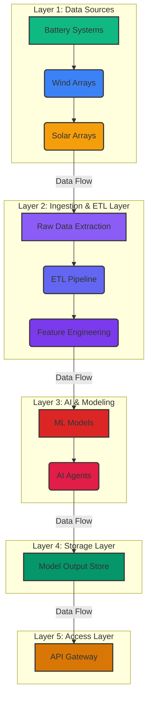

# ETL and Data Governance

## From Manual Processing to Automated Intelligence

The core need for large DER asset owners is an automated pipeline that eliminates manual data processing for analytics usage, ensures model freshness, and provides production-grade APIs—all while maintaining audit compliance and minimizing storage costs.

In today’s energy landscape, data is the most valuable asset. However, it’s often trapped in disparate systems, requiring manual, error-prone processes to make it usable. This manual effort is not only a drain on resources but also a significant barrier to realizing the full potential of AI. A robust, automated data platform is the foundation upon which true AI-driven insights are built. It allows businesses to move from reactive analysis to proactive, automated decision-making, enabling them to efficiently implement the advice the AI provides and unlock new revenue opportunities.

---

## Clean & Model Platform Foundation

Our platform is built on two core pillars that provide a solid foundation for your data and AI strategy.

### Zero-Duplication Data Pipeline

**The Challenge:** Traditional data pipelines often create multiple copies of the same data, leading to increased storage costs, data consistency issues, and a complex, difficult-to-manage data landscape.

**Our Solution:** We've engineered a "zero-duplication" data pipeline that is both efficient and cost-effective. A nightly cleaner lambda function pulls only the 24-hour delta from your inverters or company data lake. This new data is then processed using an adaptive, CPU-only interpolation method and appended to a single, versioned Parquet dataset. The raw historian is never copied, and the cleaned data is up to 8 times smaller than the original, significantly reducing storage costs and simplifying data management.

### Model Registry & Feature API

**The Challenge:** Deploying and managing machine learning models in a production environment is a complex task. Models can become stale, and there's often a disconnect between the data used for training and the data used for inference.

**Our Solution:** Our platform includes a comprehensive model registry and feature API to streamline the entire MLOps lifecycle. When model drift exceeds a predefined threshold, models are automatically retrained, and the new artifacts are pushed to storage. All model training metrics are recorded, and metadata is saved to a records table, providing a complete audit trail. The feature API then serves these feature streams to both AI agents and user-facing front-end applications, ensuring that your models are always fresh and your applications are always powered by the latest insights.

