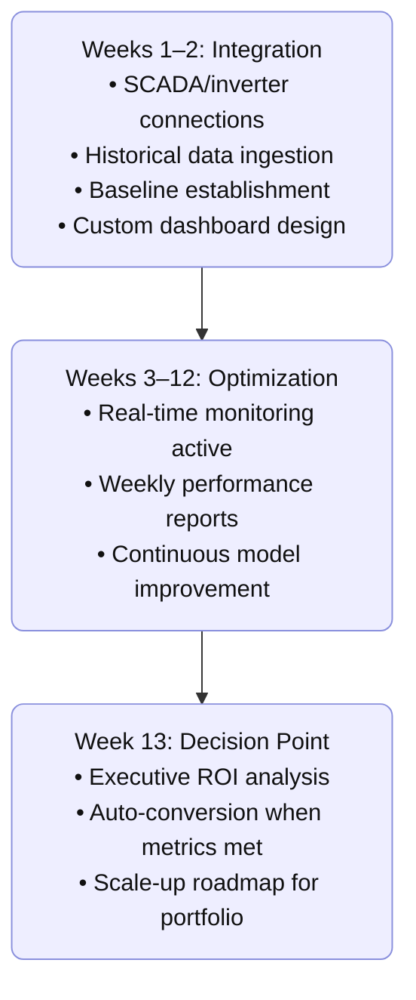

# Use Cases

Industry-specific solutions designed to address the unique challenges of solar energy management.

---

## O&M Optimization

### Challenge
Operations and Maintenance (O&M) teams need to optimize maintenance schedules, reduce costs, and maximize uptime while ensuring reliable performance.

### Solution
Our O&M optimization platform delivers:

- **Predictive Maintenance**: Use AI to predict equipment failures before they occur
- **Maintenance Scheduling**: Optimize maintenance schedules based on actual needs
- **Cost Management**: Track and optimize maintenance costs
- **Performance Monitoring**: Monitor equipment health and performance

### Key Features
- **AI-Powered Predictions**: Machine learning models predict maintenance needs
- **Work Order Management**: Streamline maintenance workflows
- **Vendor Coordination**: Coordinate with maintenance vendors efficiently
- **Performance Analytics**: Track maintenance effectiveness

### Benefits
- **Reduce Downtime**: Prevent failures before they impact production
- **Lower Costs**: Optimize maintenance schedules to reduce unnecessary work
- **Improve Efficiency**: Streamline maintenance processes
- **Extend Equipment Life**: Proactive maintenance extends equipment lifespan

---

## Insurance & Risk Management

### Challenge
Solar operators endure costly downtime and slow claim settlements when equipment fails. Traditional insurance approaches create significant challenges with manual processes and static risk models.

### Solution
Our AI-driven insurance platform provides:

- **Live Monitoring**: Continuous asset monitoring with real-time risk assessment
- **Automated Document Review**: AI-powered policy analysis and compliance tracking
- **Instant Parametric Payouts**: Pre-agreed automatic payout conditions
- **Dynamic Risk Modeling**: Real-time premium adjustments based on performance

### Key Features
- **MCP Server Coordination**: Specialized AI agents for document processing and risk monitoring
- **OODA Loop Integration**: Continuous observe-orient-decide-act workflow
- **Evidence Compilation**: Automated documentation assembly for claims
- **Compliance Management**: Regulatory requirement identification and audit scheduling

### Benefits
- **40-60% Lower Premiums**: Continuous, data-validated risk modeling
- **Instant Liquidity**: Parametric payouts in under an hour
- **80% Faster Underwriting**: Automated document review
- **Reduced Risk Costs**: Dynamic risk modeling and monitoring

---

## Implementation Roadmap

---

## Getting Started

### Quick Start Options

  

    <h3>🔧 O&M Optimization</h3>
    
Get started with predictive maintenance and operational optimization

    <a href="/use-cases/oam" class="path-button">Explore O&M Solutions</a>
  

  
  

    <h3>🛡️ Insurance & Risk</h3>
    
Transform your insurance operations with AI-driven risk management

    <a href="/use-cases/insurance" class="path-button">Explore Insurance Solutions</a>
  

  
  

    <h3>📚 Documentation</h3>
    
Learn about our platform capabilities and integration options

    <a href="/products" class="path-button">View Products</a>
  

### Implementation Support
- **Technical Consultation**: Get expert guidance on implementation
- **Custom Development**: Build custom integrations and features
- **Training & Support**: Comprehensive training and ongoing support
- **Managed Services**: Let us handle the technical implementation

---

## Get Help & Stay Updated

  

    

      <h3>Contact Support</h3>
      
For technical assistance, feature requests, or any other questions, please reach out to our dedicated support team.

      <a href="mailto:support@asoba.co" class="support-button">Email Support</a>
      <a href="https://discord.gg/nNV5evcr" target="_blank" class="support-button" style="margin-top: 10px; display: inline-block;">
        <svg width="16" height="16" style="margin-right: 8px; vertical-align: middle;" viewBox="0 0 24 24" fill="currentColor">
          <path d="M20.317 4.37a19.791 19.791 0 0 0-4.885-1.515.074.074 0 0 0-.079.037c-.21.375-.444.864-.608 1.25a18.27 18.27 0 0 0-5.487 0 12.64 12.64 0 0 0-.617-1.25.077.077 0 0 0-.079-.037A19.736 19.736 0 0 0 3.677 4.37a.07.07 0 0 0-.032.027C.533 9.046-.32 13.58.099 18.057a.082.082 0 0 0 .031.057 19.9 19.9 0 0 0 5.993 3.03.078.078 0 0 0 .084-.028 14.09 14.09 0 0 0 1.226-1.994.076.076 0 0 0-.041-.106 13.107 13.107 0 0 1-1.872-.892.077.077 0 0 1-.008-.128 10.2 10.2 0 0 0 .372-.292.074.074 0 0 1 .077-.01c3.928 1.793 8.18 1.793 12.062 0a.074.074 0 0 1 .078.01c.12.098.246.198.373.292a.077.077 0 0 1-.006.127 12.299 12.299 0 0 1-1.873.892.077.077 0 0 0-.041.107c.36.698.772 1.362 1.225 1.993a.076.076 0 0 0 .084.028 19.839 19.839 0 0 0 6.002-3.03.077.077 0 0 0 .032-.054c.5-5.177-.838-9.674-3.549-13.66a.061.061 0 0 0-.031-.03zM8.02 15.33c-1.183 0-2.157-1.085-2.157-2.419 0-1.333.956-2.419 2.157-2.419 1.21 0 2.176 1.096 2.157 2.42 0 1.333-.956 2.418-2.157 2.418zm7.975 0c-1.183 0-2.157-1.085-2.157-2.419 0-1.333.955-2.419 2.157-2.419 1.21 0 2.176 1.096 2.157 2.42 0 1.333-.946 2.418-2.157 2.418z"/>
        </svg>
        Join Discord
      </a>
    

  

  
  

    

      <link href="//cdn-images.mailchimp.com/embedcode/classic-061523.css" rel="stylesheet" type="text/css">
      
      

        <form action="https://asoba.us10.list-manage.com/subscribe/post?u=459ea321d7831d7b9f5fac70f&amp;id=e03a70f492&amp;f_id=000a9ae3f0" method="post" id="mc-embedded-subscribe-form" name="mc-embedded-subscribe-form" class="validate" target="_blank">
          

            <h3>Subscribe to Updates</h3>
            
* indicates required

            
<label for="mce-FNAME">First Name </label><input type="text" name="FNAME" class=" text" id="mce-FNAME" value="">

            
<label for="mce-EMAIL">Email Address *</label><input type="email" name="EMAIL" class="required email" id="mce-EMAIL" value="" required="">

            

              

              

            

            
<input type="text" name="b_459ea321d7831d7b9f5fac70f_e03a70f492" tabindex="-1" value="">

            
<input type="submit" name="subscribe" id="mc-embedded-subscribe" class="button" value="Subscribe">

          

        </form>
      

      
      
    

  

© 2025 Asoba Corporation. All rights reserved.
