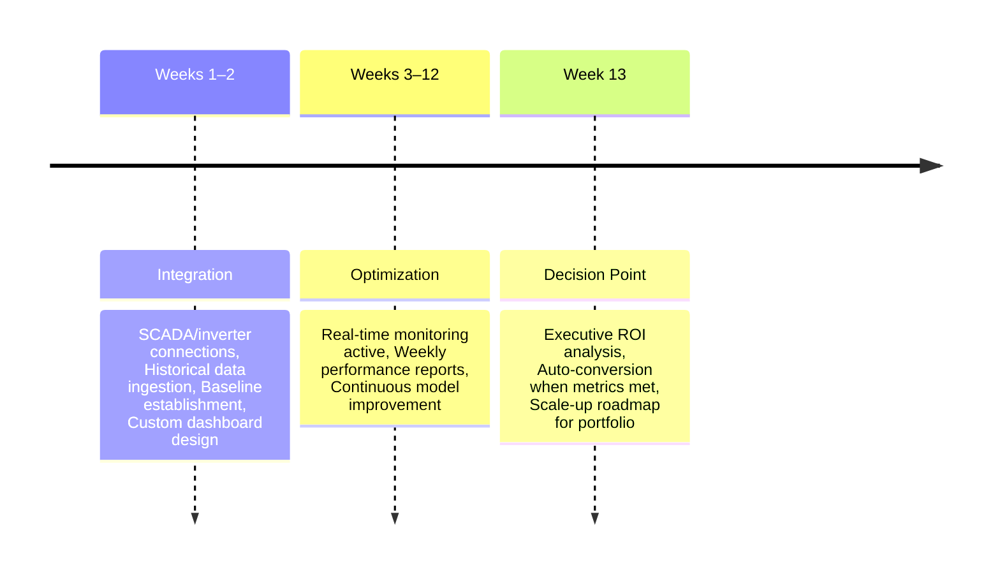

# Use Cases

Our platform offers a suite of industry-specific solutions, each powered by a modular AI agent designed to address the unique challenges of distributed energy resource management. These agents can be seamlessly embedded into your existing infrastructure via our SDK or utilized through client applications running in the cloud or on distributed compute nodes, such as Raspberry Pi or Jetson Orin series devices. This flexibility ensures optimal performance and adaptability across diverse operational environments.

---

  

    <h3>🔧 O&M Optimization</h3>
    
Optimize maintenance schedules, reduce costs, and maximize uptime with AI-powered predictive maintenance.

    <a href="/use-cases/oam" class="path-button">Explore O&M Solutions</a>
  

  
  

    <h3>🛡️ Insurance & Risk Management</h3>
    
Transform your insurance operations with AI-driven risk management, live monitoring, and instant parametric payouts.

    <a href="/use-cases/insurance" class="path-button">Explore Insurance Solutions</a>
  

  
  

    <h3>📈 Energy Trading</h3>
    
Predict the best buy/sell price arbitrage to make high-certainty trades in intraday energy markets.

    <a href="/use-cases/energy-trading" class="path-button">Explore Trading Solutions</a>
  

  

    <h3>🌬️ Turbine-Specific Wind-Flow Graph Net</h3>
    
Modeling the unique wind conditions and performance of each turbine, taking into account its exact location, local terrain, and real-time operational data.

    
<strong>Result:</strong> Improved accuracy on production forecasting

  

  
  

    <h3>🗓️ Maintenance-Market Window</h3>
    
AI agent balances expected market price, forced-outage probability, and crew calendar to optimize START-MAINTENANCE versus DEFER decisions in hourly increments. Automates "negative-price tomorrow, fix today" logic.

    
<strong>Outcome:</strong> Direct EBITDA uplift within existing maintenance budgets

  

  
  

    <h3>🤖 AI Crew-Quality Oracle</h3>
    
3B-parameter on-device chatbot interviews technicians via mobile app, extracting root-cause analysis, parts used, and labor minutes. Human responses are labelled and tagged and integrated into existing device failure probability models.

    
<strong>Outcome:</strong> Enhanced predictive maintenance accuracy, reduced repeat failures

  

  

    <h3>🔋 Battery-Buffered Bid-Sizer</h3>
    
Model to calculate minimum MWh storage required for 98% firmness target on 2-hour evening-peak bids.

    
<strong>Outcome:</strong> Trims battery CAPEX by 10–15%

    
<strong>Outcome:</strong> Maintains near-zero trading penalties

    
<strong>Outcome:</strong> Directly improves project IRR

  

  
  

    <h3>📝 Regulatory Reporting Co-Pilot</h3>
    
Auto-fill official SAWEM XML templates from existing O&M database, attaches data-quality attestation, and flags impending non-compliance.

    
<strong>Outcome:</strong> Monthly compliance drops from 3 days to 30 minutes

    
<strong>Outcome:</strong> Eliminates disqualification risk from future tenders

  

  

    <h3>📈 Penalty-Insurance Meta-Forecast</h3>
    
Model analyzes 24-hour forecast versus actuals to generate 5th–95th percentile error bands per half-hour slot. Live dashboard displays "Penalty-at-Risk", enabling traders to hedge or defer maintenance before 18:00 gate closure.

    
<strong>Impact:</strong> Up to 70% reduction in unplanned trading penalties

  

  
  

    <h3>☁️ Cloud-Shadow Nowcast for Solar</h3>
    
IP sky-cameras feed conv-LSTM predicting shadow motion 0–30 minutes ahead per string. Outputs probabilistic ramp-rate distributions to pre-position battery SOC setpoints.

    
<strong>Impact:</strong> Eliminates unnecessary cycling costs, avoids 30-second ramp violations triggering ancillary-service penalties

  

---

## Implementation Roadmap

---

## Getting Started

### Implementation Support
- **Technical Consultation**: Get expert guidance on implementation
- **Custom Development**: Build custom integrations and features
- **Training & Support**: Comprehensive training and ongoing support
- **Managed Services**: Let us handle the technical implementation

---

## Get Help & Stay Updated

  

    

      <h3>Contact Support</h3>
      
For technical assistance, feature requests, or any other questions, please reach out to our dedicated support team.

      <a href="mailto:support@asoba.co" class="support-button">Email Support</a>
      <a href="https://discord.gg/nNV5evcr" target="_blank" class="support-button" style="margin-top: 10px; display: inline-block;">
        <svg width="16" height="16" style="margin-right: 8px; vertical-align: middle;" viewBox="0 0 24 24" fill="currentColor">
          <path d="M20.317 4.37a19.791 19.791 0 0 0-4.885-1.515.074.074 0 0 0-.079.037c-.21.375-.444.864-.608 1.25a18.27 18.27 0 0 0-5.487 0 12.64 12.64 0 0 0-.617-1.25.077.077 0 0 0-.079-.037A19.736 19.736 0 0 0 3.677 4.37a.07.07 0 0 0-.032.027C.533 9.046-.32 13.58.099 18.057a.082.082 0 0 0 .031.057 19.9 19.9 0 0 0 5.993 3.03.078.078 0 0 0 .084-.028 14.09 14.09 0 0 0 1.226-1.994.076.076 0 0 0-.041-.106 13.107 13.107 0 0 1-1.872-.892.077.077 0 0 1-.008-.128 10.2 10.2 0 0 0 .372-.292.074.074 0 0 1 .077-.01c3.928 1.793 8.18 1.793 12.062 0a.074.074 0 0 1 .078.01c.12.098.246.198.373.292a.077.077 0 0 1-.006.127 12.299 12.299 0 0 1-1.873.892.077.077 0 0 0-.041.107c.36.698.772 1.362 1.225 1.993a.076.076 0 0 0 .084.028 19.839 19.839 0 0 0 6.002-3.03.077.077 0 0 0 .032-.054c.5-5.177-.838-9.674-3.549-13.66a.061.061 0 0 0-.031-.03zM8.02 15.33c-1.183 0-2.157-1.085-2.157-2.419 0-1.333.956-2.419 2.157-2.419 1.21 0 2.176 1.096 2.157 2.42 0 1.333-.956 2.418-2.157 2.418zm7.975 0c-1.183 0-2.157-1.085-2.157-2.419 0-1.333.955-2.419 2.157-2.419 1.21 0 2.176 1.096 2.157 2.42 0 1.333-.946 2.418-2.157 2.418z"/>
        </svg>
        Join Discord
      </a>
    

  

  
  

    

      <link href="//cdn-images.mailchimp.com/embedcode/classic-061523.css" rel="stylesheet" type="text/css">
      
      

        <form action="https://asoba.us10.list-manage.com/subscribe/post?u=459ea321d7831d7b9f5fac70f&amp;id=e03a70f492&amp;f_id=000a9ae3f0" method="post" id="mc-embedded-subscribe-form" name="mc-embedded-subscribe-form" class="validate" target="_blank">
          

            <h3>Subscribe to Updates</h3>
            
* indicates required

            
<label for="mce-FNAME">First Name </label><input type="text" name="FNAME" class=" text" id="mce-FNAME" value="">

            
<label for="mce-EMAIL">Email Address *</label><input type="email" name="EMAIL" class="required email" id="mce-EMAIL" value="" required="">

            

              

              

            

            
<input type="text" name="b_459ea321d7831d7b9f5fac70f_e03a70f492" tabindex="-1" value="">

            
<input type="submit" name="subscribe" id="mc-embedded-subscribe" class="button" value="Subscribe">

          

        </form>
      

      
      
    

  

© 2025 Asoba Corporation. All rights reserved.
