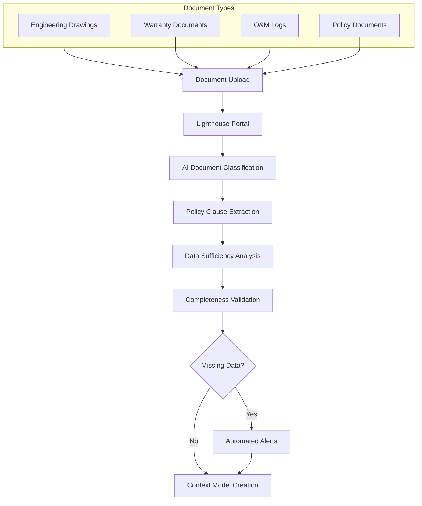
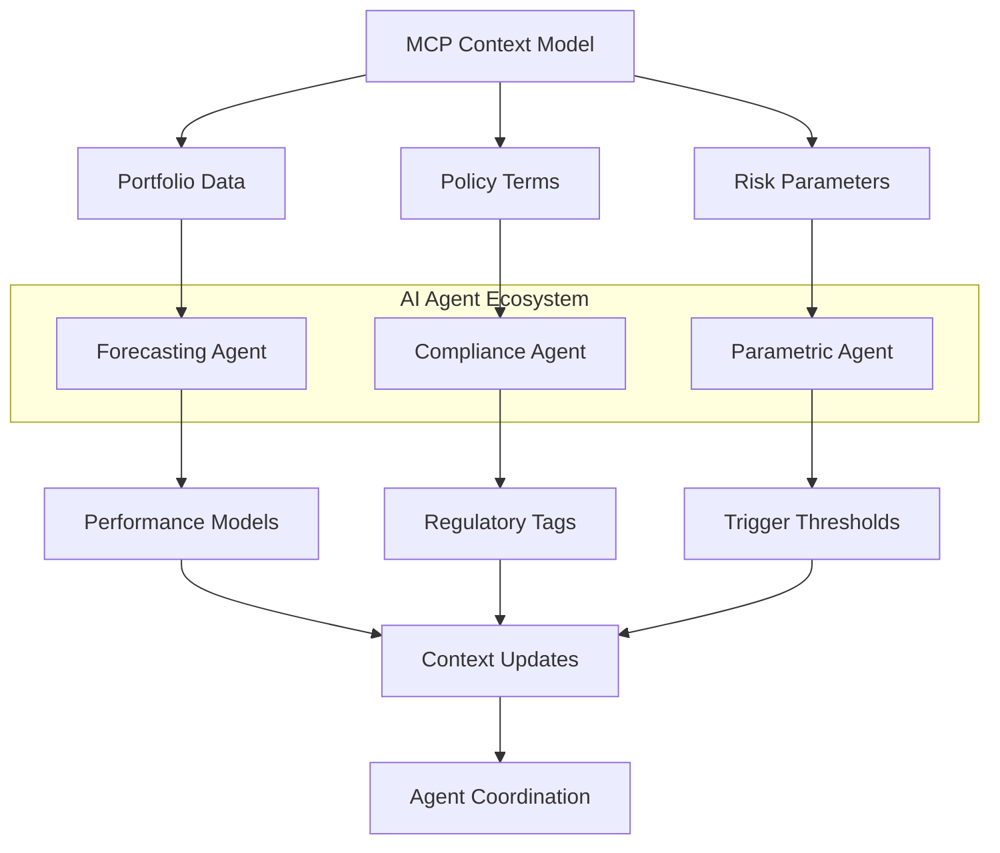
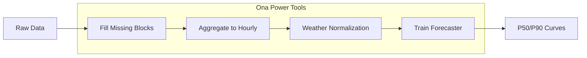
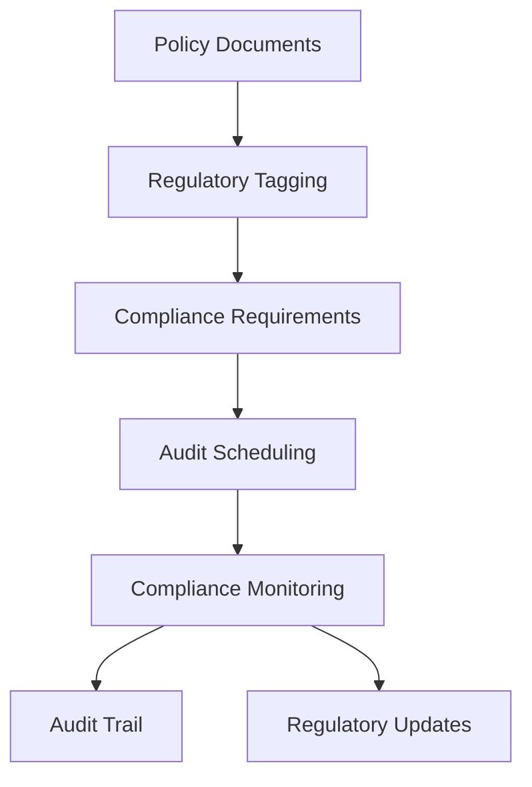
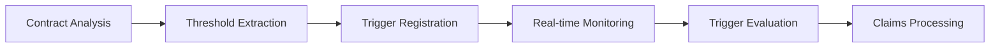
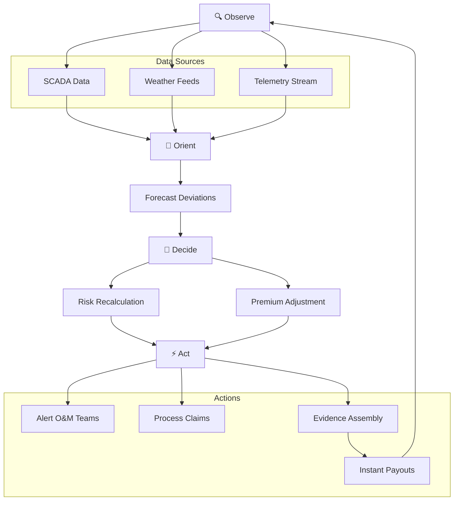
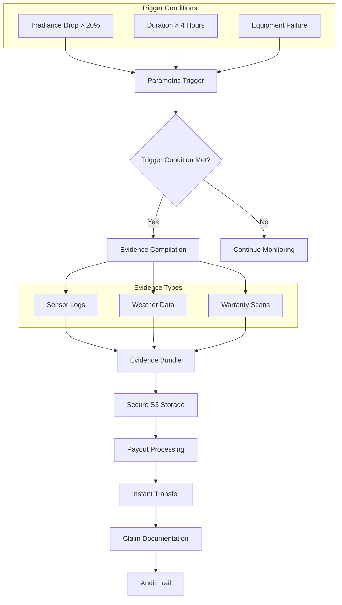
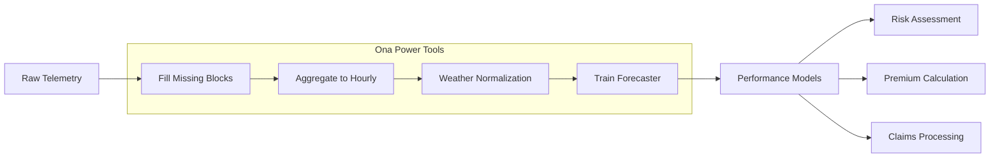

# Insurance & Risk Management

AI-driven insurance platform for solar assets with live monitoring, automated document review, and instant parametric payouts.

---

## Overview

Lighthouse is a live-monitoring, AI-driven insurance platform for mid-market solar assets (1–20 MW). At its heart sits the AsobaCode MCP (Model Context Protocol) server, which coordinates a suite of specialized AI agents to automate document review, risk monitoring, and instant payouts.

---

## Business Problem

Solar operators endure costly downtime and slow claim settlements when equipment fails. Traditional insurance approaches create significant challenges:

### Traditional Insurance Limitations
- **Manual Document Review**: Relies on one-off, manual document reviews
- **Static Risk Assumptions**: Uses outdated, static risk models
- **Slow Claim Processing**: Lags 30–60 days for claim payouts
- **High Premiums**: Inefficient processes drive up insurance costs
- **Working Capital Ties**: Extended outages tie up critical working capital

---

## How the System Works

### 1. MCP Intake & Document Review

**Automated Document Processing**:

**Key Features**:
- **Intelligent Classification**: AI fine-tuned for insurance document processing
- **Policy Clause Extraction**: Automatic identification of coverage terms
- **Data Sufficiency Analysis**: Automated completeness validation
- **Follow-up Automation**: Missing information triggers automated alerts

### 2. Agent-Driven Workflow Orchestration

**Context Model Publishing**:

**Specialized AI Agents**:

#### Forecasting Agents

#### Compliance Agents

#### Parametric Trigger Agents

### 3. Continuous OODA Loop

#### 🔍 **Observe Phase**
- **SCADA Integration**: Real-time asset monitoring data
- **Weather Services**: Environmental condition feeds
- **Telemetry Streams**: Continuous performance tracking

#### 🎯 **Orient Phase**
- **Deviation Analysis**: Compare actual vs. forecast performance
- **Threshold Monitoring**: Track parametric trigger conditions
- **Context Integration**: Apply portfolio and policy context

#### 🧠 **Decide Phase**
- **Risk Scoring**: Dynamic risk assessment and modeling
- **Premium Calculation**: Real-time premium adjustments
- **Decision Logic**: Automated response determination

#### ⚡ **Act Phase**
- **Alert Generation**: Automated O&M team notifications
- **Claims Processing**: Instant parametric payout execution
- **Evidence Compilation**: Automated documentation assembly

### 4. Instant Parametric Payouts

**Automated Claims Processing**:

---

## Business Impact & ROI

### Financial Benefits
- **40–60% Lower Premiums**: Continuous, data-validated risk modeling
- **15–25% Improved Loss Ratios**: Real-time anomaly detection
- **80% Faster Underwriting**: Automated document review
- **7–14 Day Claim Cycle**: Dramatically reduced processing time
- **60–80% Process Reduction**: Automated workflows free capacity

### Operational Benefits
- **Instant Liquidity**: Parametric payouts in under an hour
- **Reduced Risk Costs**: Dynamic risk modeling and monitoring
- **Audit-Ready Underwriting**: Comprehensive documentation and compliance
- **Transparent Process**: Real-time visibility into risk and claims status

---

## Key Features

### Automated Document Review
- **Intelligent Classification**: AI-powered document categorization
- **Policy Extraction**: Automatic identification of coverage terms
- **Completeness Validation**: Automated data sufficiency checks
- **Follow-up Automation**: Missing information triggers alerts

### Real-Time Risk Monitoring
- **Live SCADA Integration**: Continuous asset monitoring
- **Weather Data Integration**: Environmental condition tracking
- **Forecast Deviation Analysis**: Performance anomaly detection
- **Dynamic Risk Scoring**: Real-time premium adjustments

### Instant Claims Processing
- **Parametric Triggers**: Pre-agreed automatic payout conditions
- **Evidence Compilation**: Automated documentation assembly
- **Secure Storage**: S3-based evidence bundles
- **Instant Payouts**: Claims processed in minutes, not months

### Compliance & Audit Support
- **Regulatory Tagging**: Automatic compliance requirement identification
- **Audit Scheduling**: Automated audit preparation and scheduling
- **Documentation Management**: Comprehensive audit trail
- **Warranty Integration**: Automatic warranty claim support

---

## Integration Capabilities

### Data Sources
- **SCADA Systems**: Real-time operational data
- **Weather Services**: Environmental condition feeds
- **Document Management**: Engineering drawings, warranties, O&M logs
- **Financial Systems**: Premium calculations and payout processing

### AI Agent Ecosystem
- **Intake Agent**: Document processing and classification
- **Forecasting Agent**: Performance modeling and prediction
- **Compliance Agent**: Regulatory requirement management
- **Parametric Agent**: Trigger monitoring and evaluation
- **Premium Engine Agent**: Risk scoring and pricing
- **Claims Assist Agent**: Evidence compilation and payout processing
- **Alert & Repair Agent**: Anomaly notification and response

### Ona Power Tools Integration

---

## Use Case Scenarios

### Scenario A: Equipment Failure Response

**Challenge**: Inverter failure detected during peak production hours.

**Lighthouse Solution**:
1. **Instant Detection**: Parametric trigger fires immediately
2. **Evidence Compilation**: Sensor logs, weather data, warranty docs assembled
3. **Automatic Payout**: $50,000 payout processed within minutes
4. **O&M Notification**: Alert sent to maintenance team

**Business Impact**: 
- **Revenue Protection**: Immediate liquidity for repairs
- **Reduced Downtime**: Fast response prevents extended outages
- **Working Capital**: No waiting for traditional claim processing

### Scenario B: Performance Degradation Monitoring

**Challenge**: Gradual performance decline affecting revenue.

**Lighthouse Solution**:
1. **Continuous Monitoring**: Real-time performance tracking
2. **Deviation Detection**: Forecast vs. actual analysis
3. **Risk Recalculation**: Dynamic premium adjustments
4. **Proactive Alerts**: Early warning to O&M teams

**Business Impact**:
- **Preventive Maintenance**: Address issues before failure
- **Premium Optimization**: Lower rates for well-maintained assets
- **Performance Optimization**: Maximize energy production

### Scenario C: Regulatory Compliance

**Challenge**: Complex regulatory requirements for solar assets.

**Lighthouse Solution**:
1. **Automated Tagging**: Regulatory requirements identified
2. **Audit Scheduling**: Compliance audits automatically scheduled
3. **Documentation Management**: Comprehensive audit trail
4. **Compliance Monitoring**: Continuous regulatory adherence

**Business Impact**:
- **Risk Reduction**: Minimize compliance penalties
- **Audit Efficiency**: Streamlined audit preparation
- **Regulatory Confidence**: Proactive compliance management

---

## Getting Started

### Prerequisites
- Solar assets with SCADA monitoring
- Insurance policy documentation
- Weather data access
- Integration with Ona Power Tools

### Implementation Steps
1. **Document Upload**: Upload data room contents to Lighthouse portal
2. **AI Processing**: Automated document review and classification
3. **Context Modeling**: Portfolio and policy context creation
4. **Agent Deployment**: Specialized AI agents activated
5. **Live Monitoring**: Continuous OODA loop operation
6. **Claims Processing**: Parametric triggers and instant payouts

---

## Support & Resources

### Documentation
- [Lighthouse Platform Guide](https://code.asoba.org/lighthouse)
- [MCP Server Documentation](https://code.asoba.org/mcp-server)
- [Parametric Claims Guide](https://code.asoba.org/parametric-claims)

### Community
- [GitHub Repository](https://github.com/asoba/lighthouse)
- [Discord Community](https://discord.gg/2MmDG2uTxX)
- [Insurance Best Practices](https://code.asoba.org/insurance-best-practices)

### Support
- 📧 **Technical Support**: [support@asoba.org](mailto:support@asoba.org)
- 📖 **Documentation**: [code.asoba.org](https://code.asoba.org)
- 💬 **Community**: [Discord](https://discord.gg/2MmDG2uTxX)

---

## Get Help & Stay Updated

  

    

      <h3>Contact Support</h3>
      
For technical assistance, feature requests, or any other questions, please reach out to our dedicated support team.

      <a href="mailto:support@asoba.org" class="support-button">Email Support</a>
      <a href="https://discord.gg/2MmDG2uTxX" target="_blank" class="support-button" style="margin-top: 10px; display: inline-block;">
        <svg width="16" height="16" style="margin-right: 8px; vertical-align: middle;" viewBox="0 0 24 24" fill="currentColor">
          <path d="M20.317 4.37a19.791 19.791 0 0 0-4.885-1.515.074.074 0 0 0-.079.037c-.21.375-.444.864-.608 1.25a18.27 18.27 0 0 0-5.487 0 12.64 12.64 0 0 0-.617-1.25.077.077 0 0 0-.079-.037A19.736 19.736 0 0 0 3.677 4.37a.07.07 0 0 0-.032.027C.533 9.046-.32 13.58.099 18.057a.082.082 0 0 0 .031.057 19.9 19.9 0 0 0 5.993 3.03.078.078 0 0 0 .084-.028 14.09 14.09 0 0 0 1.226-1.994.076.076 0 0 0-.041-.106 13.107 13.107 0 0 1-1.872-.892.077.077 0 0 1-.008-.128 10.2 10.2 0 0 0 .372-.292.074.074 0 0 1 .077-.01c3.928 1.793 8.18 1.793 12.062 0a.074.074 0 0 1 .078.01c.12.098.246.198.373.292a.077.077 0 0 1-.006.127 12.299 12.299 0 0 1-1.873.892.077.077 0 0 0-.041.107c.36.698.772 1.362 1.225 1.993a.076.076 0 0 0 .084.028 19.839 19.839 0 0 0 6.002-3.03.077.077 0 0 0 .032-.054c.5-5.177-.838-9.674-3.549-13.66a.061.061 0 0 0-.031-.03zM8.02 15.33c-1.183 0-2.157-1.085-2.157-2.419 0-1.333.956-2.419 2.157-2.419 1.21 0 2.176 1.096 2.157 2.42 0 1.333-.956 2.418-2.157 2.418zm7.975 0c-1.183 0-2.157-1.085-2.157-2.419 0-1.333.955-2.419 2.157-2.419 1.21 0 2.176 1.096 2.157 2.42 0 1.333-.946 2.418-2.157 2.418z"/>
        </svg>
        Join Discord
      </a>
    

  

  
  

    

      <link href="//cdn-images.mailchimp.com/embedcode/classic-061523.css" rel="stylesheet" type="text/css">
      
      

        <form action="https://asoba.us10.list-manage.com/subscribe/post?u=459ea321d7831d7b9f5fac70f&amp;id=e03a70f492&amp;f_id=000a9ae3f0" method="post" id="mc-embedded-subscribe-form" name="mc-embedded-subscribe-form" class="validate" target="_blank">
          

            <h3>Subscribe to Updates</h3>
            
* indicates required

            
<label for="mce-FNAME">First Name </label><input type="text" name="FNAME" class=" text" id="mce-FNAME" value="">

            
<label for="mce-EMAIL">Email Address *</label><input type="email" name="EMAIL" class="required email" id="mce-EMAIL" value="" required="">

            

              

              

            

            
<input type="text" name="b_459ea321d7831d7b9f5fac70f_e03a70f492" tabindex="-1" value="">

            
<input type="submit" name="subscribe" id="mc-embedded-subscribe" class="button" value="Subscribe">

          

        </form>
      

      
      
    

  

© 2025 Asoba Corporation. All rights reserved.
